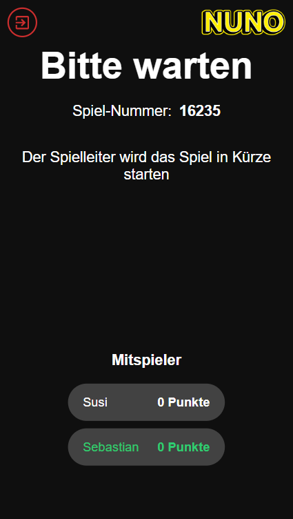
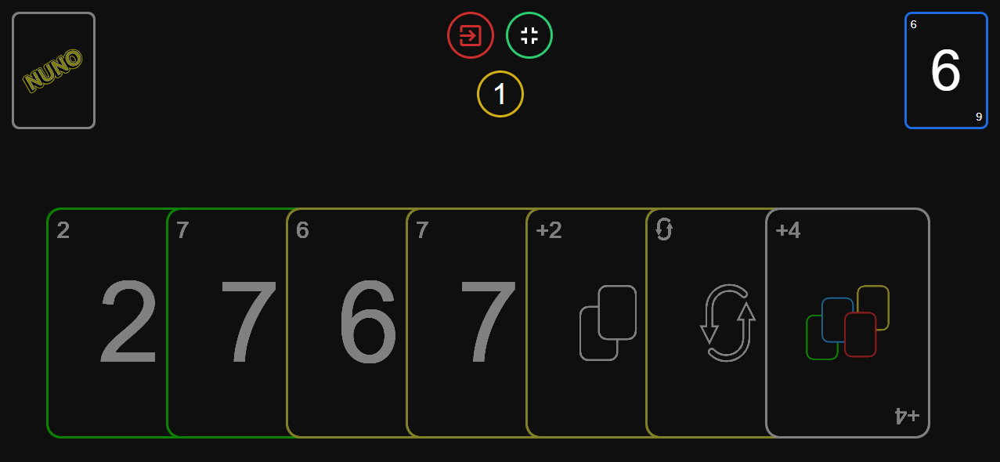

---

  
  

A Web-based multiplayer NUNO game. It's inspired by UNO, but its NUNO.

Just go to <a href="https://nussmueller.dev/">nussmueller.dev</a> and try it out.

    
    

## ❓ Why?

I really like the game UNO and I thought it would be a great exercise to build a Web-Version of it.

## 🔧 How to Install

I will add this later, for now your are on your own🙂
